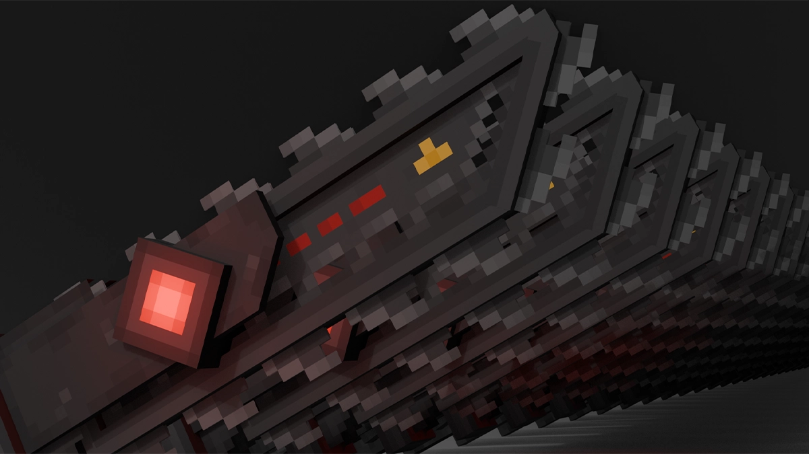

# :chains: Slasher Sword Addon :carpentry_saw:

Adds a chainsaw-sword named _Slasher_ with a spectacle combat experience to Minecraft Bedrock.

## :information_source: About

Slasher is a cool melee weapon that _was_ a part of [another addon by me](https://github.com/lc-studios-mc/scp-dystopia).

**Compatible with other addons that modify player.json, including most gun addons!**

With the sacrifice of first-person player arm skin, I've achieved a 99% compatibility.

> "THERES NOT A SINGLE MELEE WEAPON PACK THAT HAS ANIMATIONS THAT GOES ALONG WITH GUN PACKS 😭"

**No experiments required!**

<ins>No Upcoming Creator Features. No Beta APIs. This addon will likely remain stable for a long time.</ins>
By "stable", I mean it shouldn't be destroyed by a Minecraft update.

## :green_book: Learning Material

This addon is also meant to be a learning material for people who want to make cool animated melee weapons with complex mechanics without using player.json, or addon development in general.

You're expected to have at least some basic addon development knowledge before diving into this addon's source code, because it's definetely confusing for absolute beginners!

Useful resources:

- Amazing website: [Bedrock Wiki](https://wiki.bedrock.dev/)
- If you don't know Git: [Git Tutorial For Dummies](https://www.youtube.com/watch?v=mJ-qvsxPHpY)

Feel free to copy some stuff!

## :balance_scale: License

[CC0 1.0 Universal](./LICENSE) - No copyright, public domain!
